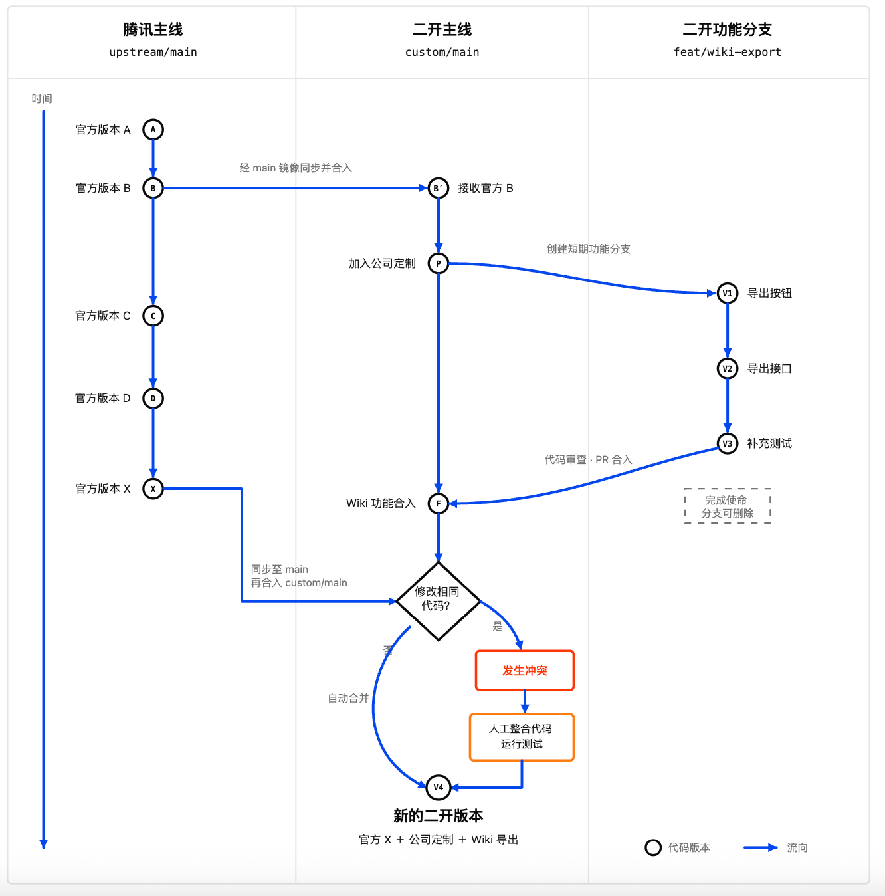
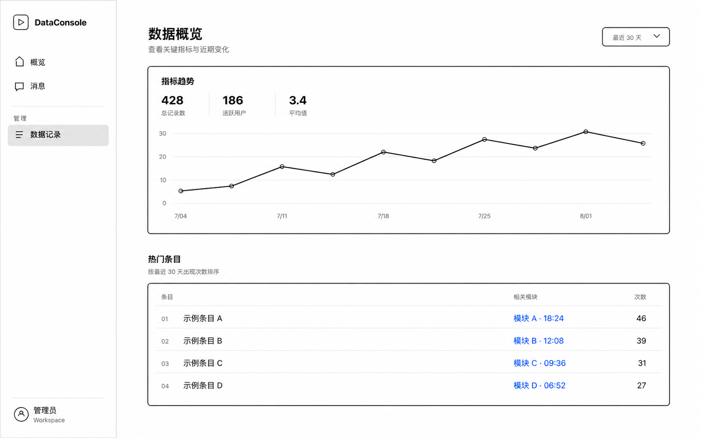
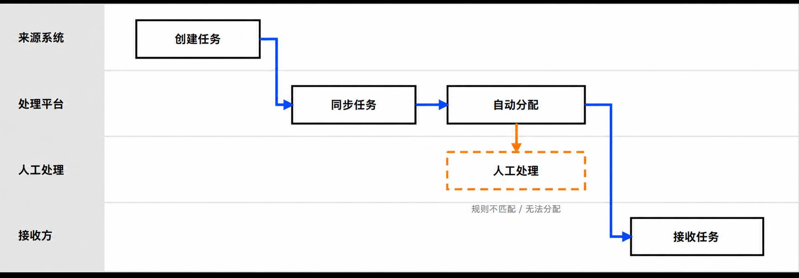
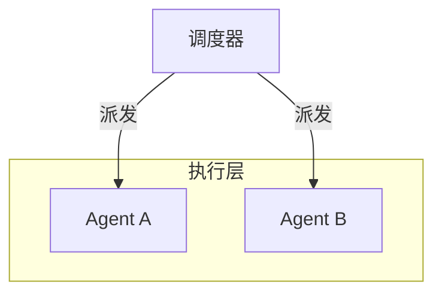

# HTML Semantic Line SVG

把文字、截图、草图或已有关系图提炼为具有教学语义的极简框线图，并实现为可访问、响应式、可编辑的原生 SVG。

这个 Skill 适合课程页、HTML Presentation、产品文档和网页卡片。对于节点关系密集的图，它可以先用 Mermaid 编写可执行的关系结构规格，再根据真实页面空间重新设计 SVG，而不是机械复制 Mermaid 的自动布局。

## 示例图

### 版本与分支流程

用于表达时间、版本、分支、合并、冲突和人工处理等关系。



### 通用后台界面线框

用于表达页面结构、信息层级、导航、指标、趋势和表格等界面语义。简单图表可以作为界面结构的一部分；复杂数据分析图表不属于本 Skill 的主要范围。



### 通用任务分发泳道图

用于表达跨系统、平台、人工环节和接收方的任务流转，以及自动路径与异常路径。



## 支持的图型

| 图型 | 适合表达的内容 |
| --- | --- |
| 系统架构与关系图 | 系统、服务、模块、接口、依赖、调用和数据流 |
| 流程图与泳道图 | 主流程、备选路径、交接物、派发、认领、审批、异常处理和跨角色协作 |
| Agent 协作图 | 中心派发、公共看板、自主认领、共享队列和多 Agent 协作 |
| 状态与包含关系图 | 等待、未完成、阻塞、消退、持续存在和内外层范围 |
| 对比图 | 新旧方案、集中式与分布式、同步设计与后期补建 |
| GUI / LUI / 接口线框 | 页面结构、机器可读字段、人机双界面和接口补建 |
| 版本与时间关系图 | 版本演进、分支、同步、合并、冲突和生命周期 |
| 教学型概念图 | 用少量对象、关系和状态解释一个明确判断 |

不适用于照片、装饰海报、情绪型手绘插画、复杂统计图表、3D 科技界面或节点极多的复杂网络图。

## Mermaid 作为语义规格

关系密集型图可以先用 Mermaid 明确节点、分组、关系动词和方向：



Mermaid 是中间语义资产，不是最终视觉成品。Skill 会保留节点身份、分组边界、关系动词、箭头方向和阅读顺序，同时补充 Mermaid 难以表达的教学结论、状态含义、布局约束、窄屏行为和可访问性要求。语法选择可参考 [Mermaid 官方图表语法文档](https://mermaid.ai/open-source/syntax/flowchart.html)。

## 工作流程

1. 提炼一条必须让读者理解的 `teaching_claim`。
2. 写对象、关系、主/备选路径、必要交接物、状态、标签、布局约束和阅读顺序。
3. 关系密集型图先写 Mermaid，并补齐 Mermaid 无法表达的语义。
4. 选择最小图型与关系语法，删除没有依据的箭头和装饰。
5. 使用 `<g>`、`<rect>`、`<path>`、`<text>` 和 `<marker>` 构造原生 SVG。
6. 在上层工作流规定的目标画布或适用视口中，验证语义、结构、几何、视觉、可访问性和项目集成。

## 默认交付

- 完整、可编辑的内联 SVG、HTML 修改或独立 `.svg` 文件
- 与最终图一致、可独立复用的线框图生成提示词
- 图型、核心对象、关键关系和特殊状态摘要
- 结构、几何、视觉、目标画布或适用视口、可访问性和集成验证结果
- 使用 Mermaid 时，附带可复制的 Mermaid 关系结构规格

## 安装

### CLI（推荐）

```bash
npx skills add simbajigege/book2skills/skills/html-line-svg
```

### 手动安装

```bash
git clone https://github.com/simbajigege/book2skills.git
cp -R book2skills/skills/html-line-svg ~/.codex/skills/
```

也可以把 `skills/html-line-svg/` 复制到其他兼容 Agent Skills 的技能目录。

## 使用示例

```text
使用 $html-line-svg，把这段系统说明画成一张适合课程页的语义框线 SVG。
先用 Mermaid 表达服务、任务和 Agent 的关系，再输出响应式内联 SVG 和生成提示词。
```

## 文件结构

```text
html-line-svg/
├── SKILL.md
├── README.md
├── LICENSE
├── agents/
│   └── openai.yaml
├── assets/
│   ├── examples/               # 可编辑 SVG 构图示例
│   └── readme/                 # README 展示图
├── references/
│   ├── example-catalog.md
│   └── implementation-patterns.md
└── scripts/
    └── validate-line-svg.mjs
```

## License

MIT — 可自由使用、修改和分发，详见 [LICENSE](./LICENSE)。
