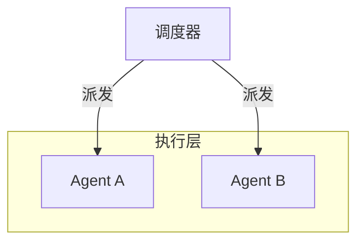

# HTML 语义框线 SVG

把原内容中的对象、关系、状态与阅读顺序，重新编码为克制的技术文档式框线图。先保证图能准确复述教学判断，再处理构图与 SVG 细节；不要把原插图机械描摹成矢量轮廓。每次交付同时生成一份自包含的线框图提示词，使同一语义设计能够被复用、复核和继续迭代。

## 开始前

1. 读取目标内容、相邻内容、现有图片或草图、承载它的 HTML/CSS 和可用空间。
2. 在 `course-design` 中工作时，读取根目录 `AGENTS.md`、`docs/design/STYLE_DNA.md`、目标页面使用的设计 token 与更具体的目录规范。
3. 修改 HTML Presentation 时同时使用项目级 `tailor-html-to-slide` skill，编辑 `*.source.html` 和源 CSS，不直接编辑生成的单文件 HTML；同步 outline、slide map、adaptation log，并执行该 skill 要求的构建与验证。
4. 保护原结论、概念边界、方向、状态与数量。无法从材料确认的关系不要画成箭头。

## 工作流

### 1. 写语义规格与可选 Mermaid 关系结构

在画图前写出一个最小规格；可放在工作笔记中，不要求成为最终页面文字。

```yaml
teaching_claim: 这张图必须让读者看懂的一个判断
objects:
  - id: object-a
    label: 对象名称
    role: interface | agent | task | container | document | state
relations:
  - from: object-a
    to: object-b
    type: flow | dispatch | claim | sync | association | compare | contains
    direction: forward | bidirectional | none
states:
  - target: object-b
    type: added-later | waiting | incomplete | fading | persistent | warning | blocked
visible_labels:
  - text: 对读者可见的文字
    role: group-title | object-label | relation-label | caption
layout_constraints:
  peer_alignment: visual-center-y | top | baseline | none
  alignment_tolerance: "0.5% of viewBox height"
  minimum_safe_gap: "2% of viewBox width"
  containment_label_zone: top | side | none
reading_order: left-to-right | top-to-bottom | center-out | board-to-peers
```

只保留支持 `teaching_claim` 的信息。名称、数量、箭头方向、实线或虚线都必须能在规格中找到语义理由。`visible_labels` 用来提前发现相邻层级的重复文字；`layout_constraints` 写相对约束，不写只适用于某一张图的坐标。

当图以节点关系为主时，优先在 YAML 之前或之后补一段 Mermaid，把它作为可执行、可预览的**关系结构规格**。系统架构、流程、Agent 协作、状态转换、时序交互、类关系和实体关系通常适合；GUI 页面线框、纯视觉对比和难以抽象为节点关系的插图可以省略。选择语法和写法时参考 [Mermaid 官方图表语法文档](https://mermaid.ai/open-source/syntax/flowchart.html)，并从该页导航到 Flowchart、Architecture、Sequence、State、Class、Entity Relationship 等对应图型。

Mermaid 规格遵循以下要求：

- 使用稳定、可读的节点 ID；把必须展示的文字写成显式标签。
- 写清分组、关系动词、箭头方向和可确认的状态；材料没有依据的连接不要添加。
- 选择能表达语义的最小图型，不为展示 Mermaid 功能而增加节点形状、颜色或关系。
- 把 Mermaid 的节点、分组和边视为语义依据，不把自动布局、折线路径、坐标或默认样式视为最终设计。
- Mermaid 不能替代 `teaching_claim`、对象角色、状态歧义说明、可见标签、布局约束、阅读顺序和窄屏行为；仍用 YAML 或紧邻 Mermaid 的文字补齐这些信息。

示例：



把 Mermaid 转为 SVG 时，保留节点身份、分组边界、关系动词、方向和阅读顺序；根据真实页面空间重新构图，不机械复刻 Mermaid 渲染结果。若使用 Mermaid，后续线框图生成提示词必须包含最终采用的 Mermaid 代码或等价的完整关系说明。

### 2. 生成线框图提示词

根据语义规格起草一份自包含的“线框图生成提示词”，并在 SVG 完成验证后按最终实现同步修订。提示词不是工作过程摘要，也不是给位图模型的氛围描述；它应让另一个具备 HTML/SVG 能力的实现者在看不到当前对话和成品的情况下，仍能重建语义一致的框线图。

提示词必须覆盖：

1. **任务与教学结论**：说明要生成 HTML 语义框线 SVG，以及读者必须理解的一个核心判断。
2. **对象与可见文字**：列出对象、角色、分组、数量和需要原样显示的标签。
3. **关系、方向与状态**：逐条说明谁连接谁、关系动词、箭头方向、线型和特殊状态；没有依据的关系不写进提示词。
4. **布局与阅读顺序**：说明构图类型、分组方式、共同锚点、阅读方向、窄屏行为和安全间距。除非精确坐标本身具有复现价值，否则使用相对约束，不固化调试坐标。
5. **视觉语法**：写明颜色的语义用途、实线与虚线含义、字体、圆角和禁用效果。
6. **SVG 技术约束**：要求 `viewBox`、语义分组、文本保留为 `<text>`、唯一 ID、`vector-effect`、`<title>`、`<desc>` 和 `aria-labelledby`。
7. **验收与输出**：要求检查语义、结构、几何、视觉、窄屏与可访问性，并输出完整可编辑 SVG，而非位图或仅提供解释。

使用 Mermaid 时，在“关系、方向与状态”中附上最终采用的 Mermaid 关系结构，随后补充 Mermaid 无法表达的角色、状态含义和布局约束；不要把 Mermaid 自动生成的样式或坐标写成 SVG 必须照抄的要求。

使用与用户一致的主要语言书写提示词；代码名、字段和命令保留原文。提示词应引用实际内容，而不是保留 `[对象名称]` 一类未填占位符。不要包含临时文件路径、调试过程、无法确认的关系或与最终 SVG 不一致的旧设计。

提示词使用下面的固定结构：

```text
# 线框图生成提示词

请根据以下规格生成一张可访问、响应式、可编辑的 HTML 语义框线 SVG。

## 任务与教学结论
[填写图的用途和唯一核心判断]

## 对象与可见文字
[填写对象、角色、分组、数量和必须出现的标签]

## 关系、方向与状态
[逐条填写关系、动词、方向、线型和状态]

## 布局与阅读顺序
[填写构图、对齐、分隔、安全距离、阅读方向和窄屏行为]

## 视觉语法
[填写颜色语义、线框、字体、圆角和禁止项]

## SVG 技术约束
[填写结构、响应式、ID、文本、描边和无障碍要求]

## 验收与输出
[填写验证要求，并要求输出完整 SVG]
```

### 3. 选择关系语法与最小图型

先按语义决定连接方式，再选择构图。箭头只表示材料能够确认的方向，不是默认连接符。

| 关系 | 图形语法 |
| --- | --- |
| 流转、派发、认领、调用 | 蓝色单向箭头；方向与动词一致 |
| 双向同步 | 蓝色双向箭头 |
| 无方向关联、配对、接触 | 黑色实线，不加 marker |
| 包含、仍然存在于某范围内 | 内外嵌套框，不画箭头；外层标签占独立安全区 |
| 并列证据、三种情况、同级对象 | 同尺度、同锚点对齐的分组，不互相连线 |
| 状态变化 | 对象位置尽量不动，改变线型或状态标签；只有明确的时间或转移关系才加箭头 |

- 对比：两个同尺度容器并列，只突出发生变化的关系或状态。
- 层级或派发：上游对象置顶，下游对象水平排布，箭头沿单一方向流动。
- 公共环境与自主协作：环境或看板占一侧，平级参与者占另一侧，用“认领”等动词标注关系。
- 人机双界面：GUI 用页面线框，LUI 用机器可读字段；补建用单向关系，同步设计用双向关系。

如果一张图需要多条交叉线、三层以上嵌套或大量说明文字，先拆图、换为编号步骤或删减非核心信息。

### 4. 整理标签与布局契约

- 盘点卡片标题、分组标题、对象标签、关系标签和图注。相邻层级表达同一信息时只保留一处；图内小标题若只是复述卡片或分组标题，直接删除。
- 三组及以上同级图先确定共同锚点。对象尺寸不同时优先对齐视觉中心；标题、角标等附属文字不作为主体对齐基准。
- 先划定每组的边界和分隔线安全区，再放对象与连线。对象框线、文字和 marker 都不能压住分隔线或相邻分组。
- 包含关系先扩大外框，再为外层标签预留独立区域和内边距；内外标签、框线不得重叠。
- 使用相对容差和安全距离；可在调试时添加辅助线或测量边界，验收前移除辅助元素。

### 5. 应用视觉语法

遵循 `docs/design/STYLE_DNA.md`：纯白、极简、留白、克制、技术文档感。

- 白色 `#FFFFFF`：画布与对象内部。
- 黑色 `#0A0A0A`：对象框线、主要文字。
- 深灰 `#171717`：次级正文；中灰 `#737373`：标签、关系动词。
- 浅灰 `#E5E5E5`：分隔线、外层辅助边界。
- 蓝色 `#0348ED`：仅用于方向、链接、认领、派发、同步等关系；不要用作普通说明文字或大面积对象填充。
- 橙色 `#FE7E0F`：提示、任务角标、尚未成熟等警示。
- 红色 `#FF3700`：阻碍、冲突、错误或缺口；没有负面语义时不要使用。
- 实线框：已存在、可用、确定的对象。
- 虚线框：后来补建、等待、未完成、正在退去或候选状态；必须由文字或上下文消除歧义。
- 等宽字：`name`、`desc`、参数、命令和其他机器可读字段。
- 圆角保持轻微，通常 `rx="2"` 到 `8`；不要做药丸化卡片。

绝不添加渐变、阴影、滤镜、纹理、噪点、复杂背景、3D、科技感 UI、装饰图标或无语义连线。不要追求“可爱”“怪诞”“海报感”。

### 6. 构造 SVG

1. 使用稳定的 `viewBox` 坐标系，优先从 `0 0 600 250` 起步，再按内容调整。
2. 使用 `<g>` 按对象、关系和状态分组；使用 `<rect>`、`<line>`、`<path>`、`<text>`、`<tspan>` 与 `<marker>`。需要几何验收时可添加 `data-align-group`、`data-boundary`、`data-relation` 等语义属性。
3. 保留文字为 SVG 文本，不把文字转路径，不使用 `<foreignObject>`。
4. 为每张图添加 `role="img"`、`aria-labelledby`、带唯一 ID 的 `<title>` 与 `<desc>`。`desc` 要说明对象、关系、方向和特殊状态，不只重复标题。
5. 同一 HTML 文档内所有 `id` 唯一，尤其是箭头 marker。以页面或组件 ID 作为前缀，例如 `s07-native-arrow-end`。
6. 对线条使用 `vector-effect: non-scaling-stroke`；箭头与关系线使用同一语义颜色。
7. 让 HTML/CSS 承担尺寸、字体和 token 映射，SVG 承担结构。需要独立 SVG 文件时，可内嵌最小 `<style>` 并沿用同一 token 值。

实现模式、CSS 容器和可访问性模板见 [references/implementation-patterns.md](references/implementation-patterns.md)。

### 7. 嵌入 HTML 并适配窄屏

- 外层容器设置 `width: 100%`、`min-width: 0`、适度内边距与 `overflow: hidden`。
- SVG 设置 `display: block; width: 100%; height: auto;`，用 `max-height` 控制卡片内视觉重量。
- 两栏在窄屏堆叠时保持相同阅读顺序，不依赖仅桌面成立的箭头位置。
- 避免小字号与长句。标签优先使用 2–6 个字；需要换行时使用 `<tspan x="…" dy="…">` 明确控制。
- 不使用 SVG 固定像素宽高来替代响应式 CSS。

### 8. 验证

依次检查：

1. 语义：图是否准确表达 `teaching_claim`；逐条核对关系语法，确认箭头、虚线与颜色都有依据，且没有相邻重复标签。
   - 使用 Mermaid 时，先在可用的 Mermaid 渲染器中预览或做语法检查，再逐项核对 Mermaid 与最终 SVG 的节点、分组、关系动词和方向；无法执行渲染时明确记录未检查。
2. 结构：运行 `node .agents/skills/html-line-svg/scripts/validate-line-svg.mjs <svg-or-html> [...]`。该脚本检查 SVG 结构，不替代几何验收。
3. 几何：在真实页面的桌面与窄屏视口测量同级主体的对齐偏差、对象到分隔线的安全距离、嵌套框的包含关系，以及文字、框线和连线之间的碰撞；同时检查 `viewBox` 裁切与溢出。含三组以上同级对象、分隔线或嵌套框时必须做此项。
4. 视觉：查看真实页面截图，确认阅读顺序、视觉重心和留白稳定，不因技术上“未相交”就忽略贴边或失衡。
5. 可访问性：确认 `<title>`、`<desc>` 与 `aria-labelledby` 对应，正文即使不看图也能理解核心判断。
6. 提示词一致性：逐项对照最终 SVG 与提示词，确认对象、文字、关系、布局、颜色语义和输出要求一致；实现过程中已经放弃的方案不得残留在提示词中。
7. 集成：执行目标项目已有的构建和验证命令；不要只验证孤立 SVG。

## 标准输出

每次使用本技能，默认交付以下四项；只有用户明确要求省略时才减少：

1. **SVG 成品**：完整的内联 SVG、目标 HTML 修改，或独立 `.svg` 文件。
2. **线框图生成提示词**：按第 2 步的固定结构填写，内容与最终 SVG 一致且可独立复用。
3. **交付摘要**：用简短文字说明图型、核心对象、关键关系和特殊状态。
4. **验证结果**：说明结构、几何、视觉、窄屏、可访问性和项目集成检查的结果；没有执行的检查必须明确标注。

使用 Mermaid 时，再交付一份可复制的 Mermaid 关系结构规格；可以放在线框图生成提示词的“关系、方向与状态”中，不要求另建文件。Mermaid 只作为中间语义资产，SVG 仍是最终图形交付物。

创建独立文件时，将提示词保存为与 SVG 同名的 `<basename>.prompt.md`，例如：

```text
agent-collaboration.svg
agent-collaboration.prompt.md
```

直接修改 HTML 或在对话中返回内联 SVG 时，在交付信息中用独立的 Markdown 代码块输出完整提示词。不要把提示词只藏在工作笔记、SVG 注释或 `<desc>` 中。

## 复用示例

需要选择构图、比较视觉语义或复制起始结构时，读取 [references/example-catalog.md](references/example-catalog.md)，并查看 `assets/examples/` 中四张可独立打开的 SVG：

- `centralized-agent-dispatch.svg`
- `distributed-agent-claim.svg`
- `gui-lui-retrofit.svg`
- `gui-lui-native.svg`

复制示例后必须重写标题、描述、ID、文字、数量与关系；示例是视觉语法，不是内容模板。

## 完成标准

- 图的教学判断可以用一句话复述。
- 标准输出包含与最终图一致、没有未填占位符、可脱离当前对话独立使用的线框图生成提示词。
- 每个对象、关系、状态和强调色都有明确语义。
- 使用 Mermaid 时，其节点、分组、关系动词和方向与最终 SVG 一致，且最终构图没有机械照搬 Mermaid 自动布局。
- 相邻层级没有重复标签，蓝色只表达真实的方向或链接语义。
- SVG 可内联、可缩放、可访问，文档内 ID 不冲突。
- 同级主体对齐且与分隔线保持安全距离；嵌套框的标签、边界和内容不碰撞。
- 桌面和窄屏均无溢出、裁切或不可读文字。
- 风格保持纯白、少色、细线、无阴影，不抢夺正文注意力。
- 修改现有课件时，源文件、追溯文件、生成物和验证结果保持一致。
